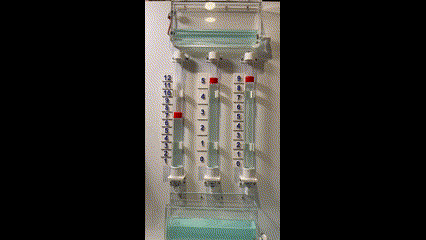
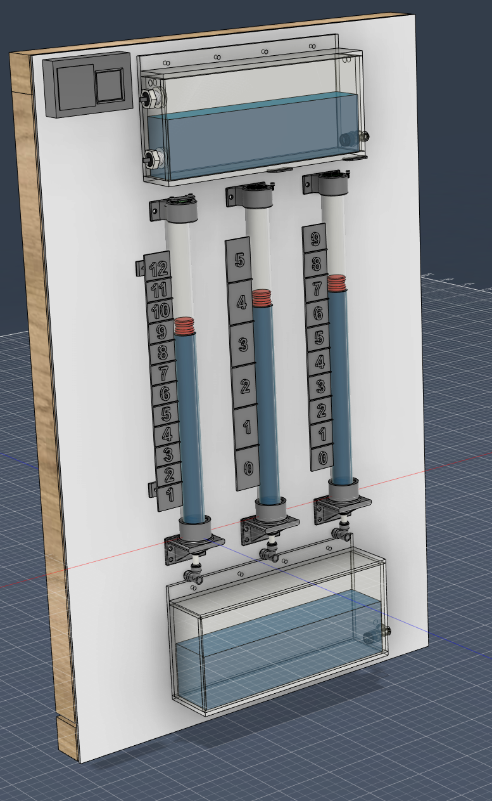
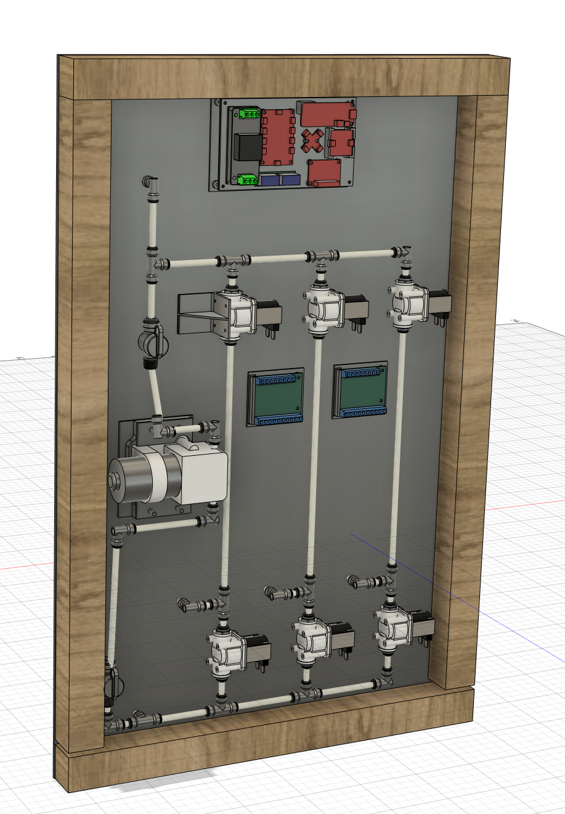
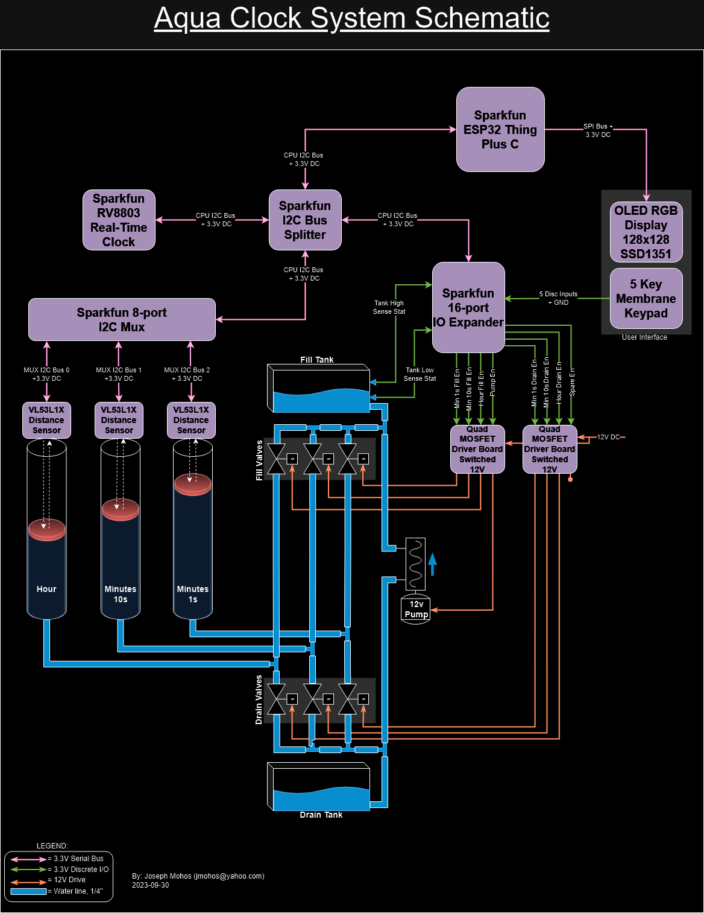
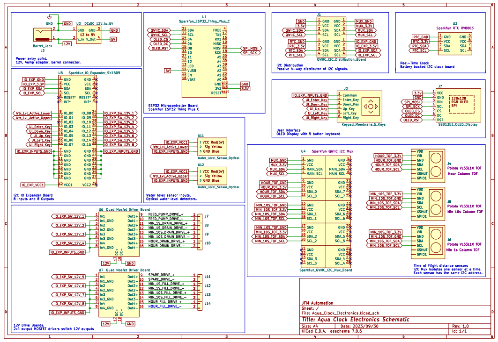

# AquaClock

## **What is this thing?**

The AquaClock project is a kinetic clock using water, tubes, ESP32, pumps, valves, time-of-flight sensors and Arduino to display time.

## Why?

I love clocks.  The more unique the better.  One day I was touring the Queen Mary engine room and I fell in love with the steampunk style gauges.  Then inspiration hit me, why not make a clock that quietly tells time using a floating marker?

After 4 months of tinkering on Fusion360, printing 30+ 3D parts, building Arduino SW, ordering parts from Amazon, DigiKey and Pololu I have a working prototype!

## Design Goals

* Has to tell time in the form of Hours and Minutes.
* Has to be silent.  Only a slight purring of a quiet pump once an hour max.
* Has to show organic movement.
* Has to be wall hangable to install in my office.
* Has to be accurate and battery backed.
* Has to run without the need for Wifi or bluetooth.
* Has to support sleeping during specified hours.
* Has to be readable from across my office from a wide viewing angle.
* Has to have a simple user interface to set the time, set sleep periods and calibrate the markers.
* Has to manage transfering water between tanks fully automated.
* Has to be captured in a CAD program to share with others.
* Has to be fun to watch!

## 3D Design on Fusion 360

One of my personal goals was to capture the design in a 3D CAD program.  I have been playing with Fusion 360 and really enjoy using it.  So I started to pull together acrylic tubes, 1/4" tubing, fittings and colored water to experiment with gravity fed water regulation.

The result is dozens of components comprised of off the shelf parts and custom parts.  I wanted to highlight not just the water in the tubes to tell time but also the tanks holding the water for gravity feeding.  The clock needs to be kinetic, moving and organic.

The back shows the array of valves, pump, plumbing and electronics to make it al work together.

## The Results

After 3D printing, fitting, glueing, sanding, painting, soldiering, criming and fastening this is the result:

Front View:

Rear View:

Here are the details highlighted:

## The Electronics
Architecture:

Schematics:

## The Software

The Sparkfun ESP32 Thing Plus C is the heart of the controls assembly.
